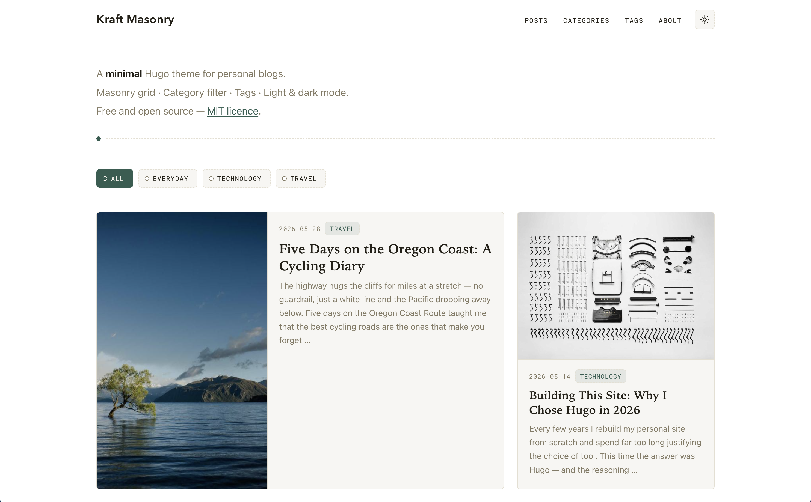
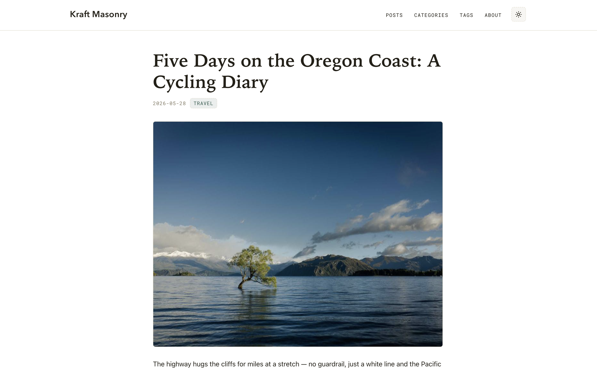

# Kraft Masonry

A minimal Hugo theme for personal blogs.

**Homepage**: site title in the top-left header, a hero area with one or more subtitle lines (markdown formatting supported), a client-side category filter, and a CSS Grid masonry with automatic bento-style tiling — some cards span two columns and display their image and text side by side. **Single posts**: classic title-and-content layout with a clickable tag list at the bottom. Full **light / dark mode** support with system detection and a manual toggle.

No npm, no Sass, no external fonts or CDN dependencies. CSS and JS are processed entirely through Hugo Pipes.

---

## Screenshots


***


---

## Features

- **Masonry homepage** — CSS Grid with `grid-auto-flow: dense` for automatic gap filling
- **Bento-style wide cards** — selected cards span 2 columns with image and text side by side
- **Client-side category filter** — instant filtering by category, no page reload
- **Tag taxonomy** — tag list at the bottom of each post, clickable tag cloud at `/tags/`
- **Light / dark mode** — system preference detection + manual toggle persisted to `localStorage`
- **Responsive** — 3 / 2 / 1 column breakpoints, with an optional toggle to hide the hero on mobile
- **Inline image shortcode** — `` with `left` / `right` / `center` / `full` alignment, optional caption and width override; floats collapse gracefully on mobile
- **Structured data** — optional JSON-LD (schema.org) per post, from a `schema` front-matter block
- **EchoThread comments** — opt-in comment section per post; set `params.echothread.apiKey` to enable
- **No external dependencies** — system font stacks, Hugo Pipes for CSS/JS minification and fingerprinting
- **i18n ready** — Italian and English string files included; add more via `i18n/`

---

## Requirements

Hugo **0.143.0** or later (extended edition recommended for future Sass support).

---

## Installation

### Option A — Git submodule (recommended)

```bash
cd your-site
git submodule add https://github.com/YOUR_USERNAME/hugo-kraft-masonry.git themes/hugo-kraft-masonry
```

Then in your `hugo.toml`:

```toml
theme = "hugo-kraft-masonry"
```

### Option B — Direct copy

Copy the `hugo-kraft-masonry/` folder (excluding `exampleSite/`) into your site's `themes/` directory.

### Try the demo site

The `exampleSite/` directory contains a ready-to-run site with six sample posts across three categories ("Viaggi", "Tecnologia", "Vita quotidiana") and multiple tags.

```bash
mkdir my-site && cd my-site
git submodule add https://github.com/YOUR_USERNAME/hugo-kraft-masonry.git themes/hugo-kraft-masonry
cp -r themes/hugo-kraft-masonry/exampleSite/* .
hugo server
```

---

## Configuration

A minimal `hugo.toml`:

```toml
baseURL  = "https://example.com/"
title    = "My Blog"
theme    = "hugo-kraft-masonry"

# i18n: set to "it" for Italian UI strings, "en" for English
defaultContentLanguage = "en"

[taxonomies]
  category = "categories"
  tag      = "tags"

[params]
  description = "A personal blog about travel, tech, and everyday life."
  author      = "Your Name"

  [params.hero]
    subtitle = [
      "A **minimal** Hugo theme for personal blogs.",
      "Masonry grid · Category filter · Tags · Light & dark mode.",
      "Free and open source — [MIT licence](https://github.com/YOUR_USERNAME/hugo-kraft-masonry/blob/main/LICENSE)."
    ]
```

### All parameters

| Parameter | Default | Description |
|---|---|---|
| `params.hero.subtitle` | — | Array of strings rendered below the site header as the homepage hero. Each element is a separate line, processed through Hugo's `markdownify` — inline Markdown is fully supported: `**bold**`, `*italic*`, `[link](url)`, and raw HTML (requires `markup.goldmark.renderer.unsafe = true`). The hero is **not shown** if this key is absent. |
| `params.disableDescriptionMobile` | `false` | When `true`, hides the homepage hero / intro block (the `hero.subtitle` lines) on viewports ≤ 640px. The hero stays visible on tablet and desktop. Handy for surfacing the post grid immediately on small screens. Implemented by adding the `hero--hide-mobile` class to the hero in `layouts/index.html`, which a `@media (max-width: 640px)` rule in `main.css` sets to `display: none`. |
| `params.description` | — | Fallback meta description for pages that don't define their own. |
| `params.author` | site `title` | Displayed in the right footer span when `params.footer.right` is not set. |
| `params.footer.left` | `© <year> <site title>` | Left span of the footer. Accepts inline Markdown (`**bold**`, `[link](url)`, HTML entities). Rendered with Hugo's `markdownify`. |
| `params.footer.right` | i18n `builtWith` + `params.author` | Right span of the footer. Accepts inline Markdown. Rendered with Hugo's `markdownify`. |
| `params.dateFormat` | `:date_long` | Layout for the **visible** post date, rendered with Hugo's locale-aware `time.Format`. Use a predefined token — `:date_full`, `:date_long` (e.g. *June 19, 2026* / *19 giugno 2026*), `:date_medium`, `:date_short` — or a custom Go layout, e.g. `02/01/2006` → *19/06/2026* (numeric, day-first). Month and weekday names are localized to the page language; the `<time datetime>` attribute always stays ISO 8601. For per-language formats, set it under `[languages.xx.params]`. |
| `params.mainSections` | `["posts"]` | Content sections treated as "posts" for the homepage masonry grid. |
| `params.homepagePostLimit` | `12` | Maximum number of posts shown in the homepage grid, sorted by date descending. |
| `params.enableCategoryFilter` | `true` | Show / hide the category filter bar and its JS on the homepage. |
| `params.wideCardEvery` | `4` | Controls wide-card frequency when `featured` is not set in front matter. A card is made wide when `(len(title) + len(permalink) + date.YearDay) mod wideCardEvery == 0`. Default: roughly 1 in 4 cards. |
| `params.googleAnalytics` | — | GA4 measurement ID (e.g. `G-XXXXXXXXXX`). When set, the `gtag.js` snippet is injected in `<head>` — only on production builds (`hugo --environment production` / `HUGO_ENV=production`), so local/preview traffic isn't tracked. |
| `params.echothread.apiKey` | — | EchoThread API key from your dashboard. When set, the comment widget is rendered at the bottom of every post. Leave unset to disable comments entirely. |
| `params.echothread.shortname` | — | Your EchoThread shortname (the `data-shortname` attribute on the widget). |
| `params.echothread.theme` | `auto` | Widget colour scheme: `auto` (follows OS preference), `light`, or `dark`. |
| `params.echothread.accentColor` | — | Optional hex colour for the widget accent (e.g. `#2f5d50` to match the theme default). |

---

## Post front matter

```yaml
---
title: "My Post Title"
date: 2026-06-01
categories: ["travel"]     # one or more categories
tags: ["gravel", "italy"]  # one or more tags
image: "https://..."       # cover image URL (optional)
featured: true             # force this card to be wide (optional)
summary: "A hand-written summary shown in the card instead of the auto-generated one."  # optional
---

Opening paragraph — used as the card abstract when no summary field is set.

<!--more-->

Rest of the post body.
```

### Cover image

Two lookup strategies, in priority order:

1. **Page bundle resource**: if the post is a [page bundle](https://gohugo.io/content-management/page-bundles/) and contains a file whose name starts with `cover`, `feature`, or `thumbnail` (e.g. `cover.jpg`), it is used automatically.
2. **`image` front matter parameter**: an absolute URL or site-root path.

If neither is present the card is shown without an image (text adjusts automatically).

### Abstract

The card abstract comes from Hugo's `.Summary`, processed through three fallback strategies in priority order:

1. **`summary` front matter field** — write the abstract directly in the post header. Hugo uses this verbatim, giving you full control over wording without touching the post body:
   ```yaml
   summary: "A concise, hand-crafted description shown in the homepage card."
   ```
2. **`<!--more-->` marker** — everything before the marker becomes the summary. The marker also controls where Hugo truncates the post on list pages.
3. **Automatic** — Hugo takes the first ~70 words of the body if neither of the above is present.

Regardless of the source, the theme truncates the final string to **200 characters** for normal cards and **240 characters** for wide (`featured`) cards. This means a long `summary` field or a lengthy `<!--more-->` section will still be cut off at those limits in the card — they only affect what text is available before truncation, not the truncation itself.

---

## Inline images

Use the `` shortcode to insert images anywhere in the body of a post with explicit alignment. Hugo's standard Markdown `` syntax still works and produces a centred block image, but the shortcode adds float support and captions.

```



```

| Parameter | Default | Description |
|---|---|---|
| `src` | *(required)* | Path or URL of the image. |
| `alt` | `""` | Alternative text for accessibility. |
| `align` | `center` | `left` — float left, text wraps right. `right` — float right, text wraps left. `center` — centred block. `full` — 100 % content width. |
| `caption` | — | Optional caption rendered in `<figcaption>` (monospace, muted, centred). |
| `width` | — | Explicit width override, e.g. `300px` or `50%`. Overrides the default 42 % float width. |

Floating images (`left` / `right`) are 42 % wide (max 420 px) on desktop and revert to full-width on viewports ≤ 600 px. To stop text wrapping after a float, insert an empty paragraph with the `img-clear` class:

```html
<div class="img-clear"></div>
```

---

## Wide cards (bento tiling)

Cards with the `post-card--wide` class span 2 grid columns. On screens ≥ 760 px the image and text are displayed side by side; below that breakpoint (or on single-column mobile) they stack normally.

**Which cards are wide?** Decided per post in this order:

1. **Front matter override** (explicit, stable):
   ```yaml
   featured: true   # always wide
   featured: false  # never wide
   ```
2. **Deterministic pseudo-random** (when `featured` is not set): computed from `len(title) + len(permalink) + date.YearDay` modulo `params.wideCardEvery` (default `4`). The result is stable across rebuilds — layout does not shift between deploys.

> **Note on `grid-auto-flow: dense`**: to fill gaps left by wide cards, the browser may display a later post visually before an earlier one. Reading / tab order always follows the markup (date order). If you want strict visual order, remove `dense` from the masonry rule in `assets/css/main.css` — gaps will remain empty instead.

---

## Category filter

The filter bar above the grid is purely **client-side** (no page reload):

1. `partials/category-filter.html` renders one button per category in `.Site.Taxonomies.categories`, with `data-filter="<slug>"`.
2. `partials/post-card.html` adds `data-categories="slug1 slug2 ..."` to each card.
3. `assets/js/filter.js` listens for clicks and toggles the `hidden` attribute on non-matching cards.

Slugs are generated with Hugo's `urlize` function on both sides, so mixed-case category names always match correctly.

Without JS the filter bar is visible but inert — all posts remain shown. For JS-free category browsing the dedicated `/categories/<slug>/` pages (linked from card tags and from `/categories/`) remain available.

---

## Tag taxonomy

With `[taxonomies] tag = "tags"` in `hugo.toml`, Hugo automatically generates:

- **`/tags/`** — alphabetical tag cloud with post counts.
- **`/tags/<slug>/`** — masonry grid of all posts carrying that tag, with a `# Tag Name · N posts` header.

Tags are linked from the footer of each single post (shown only when `tags` is defined in front matter and the page type is not `page`). Hovering a tag pill fills it with the accent colour — the same interaction as the active category filter button.

---

## Footer

The footer has two configurable spans — left and right — set via `[params.footer]` in `hugo.toml`. Both accept inline Markdown and are rendered with Hugo's `markdownify`.

```toml
[params.footer]
  left  = "&copy; 2026 My Blog"
  right = "Built with [Hugo](https://gohugo.io) &amp; **Kraft Masonry**"
```

If either key is omitted, the theme falls back to its default:
- **left** — `© <current year> <site title>` (auto-updated each build)
- **right** — the i18n `builtWith` string followed by `params.author` (or the site title if `author` is not set)

---

## Google Analytics

Set `params.googleAnalytics` in `hugo.toml` to your GA4 measurement ID to enable tracking:

```toml
[params]
  googleAnalytics = "G-XXXXXXXXXX"
```

The `gtag.js` snippet is injected in `<head>` (see `layouts/partials/google-analytics.html`) only when building with `hugo --environment production` or `HUGO_ENV=production`, so `hugo server` and preview builds don't send traffic. Leave the parameter unset to disable analytics entirely.

---

## Comments (EchoThread)

[EchoThread](https://echothread.io) is a privacy-first, lightweight comment service (no ads, no tracking, < 15 KB). Set `params.echothread.apiKey` in `hugo.toml` to render the widget at the bottom of every post:

```toml
[params.echothread]
  apiKey      = "YOUR_API_KEY"   # from echothread.io dashboard (required)
  shortname   = "yourshortname"  # your EchoThread shortname (required)
  theme       = "auto"           # auto | light | dark (default: auto)
  accentColor = "#2f5d50"        # optional — match your brand colour
```

Leave the block absent (or omit `apiKey`) to disable comments entirely — no HTML is emitted.

Each post's comment thread is identified by `File.UniqueID` (an MD5 of the source file path), so threads survive URL changes. `data-page-url` and `data-page-title` are passed automatically for the dashboard view. The widget language follows the page's Hugo language code (`data-lang`).

---

## Structured data (JSON-LD)

Any post can carry an optional `schema` front-matter block, which the theme renders as a `<script type="application/ld+json">` (schema.org) in `<head>` — improving SEO and rich-result eligibility. Page-derived fields (headline, dates, URL, cover image, word count, language) are filled in automatically; the block adds the semantic metadata. Front-matter `type` keys map to the JSON-LD `@type`, and omitted fields fall back to site values (`params.author`, the site title as publisher, the site language). Pages without a `schema` block emit nothing.

```yaml
schema:
  type: "BlogPosting"            # JSON-LD @type (default: BlogPosting)
  inLanguage: "en-us"            # default: site language
  articleSection: "Technology"   # default: first category
  author:
    name: "Jane Doe"
    url: "https://example.com/about/"
  publisher:
    name: "My Blog"
    url: "https://example.com/"
  keywords: ["hugo", "performance"]   # default: post tags
  about:                          # entities the post is about
    - type: "SoftwareApplication"
      name: "Hugo"
      sameAs: "https://gohugo.io/"
  mentions:                       # entities merely mentioned
    - type: "Person"
      name: "Ada Lovelace"
      sameAs: "https://en.wikipedia.org/wiki/Ada_Lovelace"
```

The JSON is assembled with Hugo's `dict`/`slice` and serialised with `jsonify`, so quoting and escaping are always valid. See `layouts/partials/schema.html`, and validate output with Google's [Rich Results Test](https://search.google.com/test/rich-results) or [Schema Markup Validator](https://validator.schema.org/).

---

## Light / dark mode

- On load, an **inline blocking script** in `<head>` (`partials/theme-init.html`) sets `data-theme="light"` or `"dark"` on `<html>` before the first paint, reading `localStorage` first, then `prefers-color-scheme`. No flash.
- The **sun / moon toggle button** in the header (SVG icons, no icon font) flips `data-theme` and persists the choice to `localStorage`.
- **Without JS**, a `@media (prefers-color-scheme: dark)` rule applies the dark palette automatically when the OS is in dark mode.

Both themes are defined as CSS custom properties:

```css
:root                    { /* light theme */ }
:root[data-theme="dark"] { /* dark theme  */ }
```

---

## Typography & design tokens

All colours, fonts, and key dimensions are defined as CSS custom properties in `assets/css/main.css`. Override any of them without touching the rest of the stylesheet:

```css
:root {
  /* Colours — light theme */
  --color-bg:         #ffffff;
  --color-surface:    #f7f6f2;
  --color-ink:        #232017;
  --color-muted:      #837a64;
  --color-accent:     #2f5d50;
  --color-on-accent:  #fbf8f1;
  --color-line:       #e4dfd1;

  /* Font stacks */
  --font-title:   "Avenir Next", "Century Gothic", "Futura", "Trebuchet MS", sans-serif;
  --font-display: "Iowan Old Style", "Palatino Linotype", "Source Serif Pro", Georgia, serif;
  --font-body:    -apple-system, BlinkMacSystemFont, "Segoe UI", Helvetica, Arial, sans-serif;
  --font-mono:    "IBM Plex Mono", "SF Mono", "Roboto Mono", Consolas, monospace;
}
```

Three intentionally different typefaces:
- **`--font-title`** (geometric sans) — site logo in the header
- **`--font-display`** (serif) — post titles in cards and single pages
- **`--font-body`** (system sans) — body text

To use a self-hosted custom font (e.g. for GDPR / privacy reasons), add `@font-face` rules at the top of `main.css` and update the relevant `--font-*` variable.

---

## File structure

```
hugo-kraft-masonry/
├── archetypes/
│   └── default.md              # default front matter for "hugo new"
├── assets/
│   ├── css/main.css            # all styles (design tokens in :root)
│   └── js/
│       ├── filter.js           # client-side category filter
│       └── theme-toggle.js     # light/dark toggle
├── i18n/
│   ├── en.toml                 # English UI strings
│   └── it.toml                 # Italian UI strings
├── layouts/
│   ├── 404.html
│   ├── index.html              # homepage: hero + filter + masonry
│   ├── _default/
│   │   ├── baseof.html         # shared HTML skeleton
│   │   ├── list.html           # sections, category pages, tag pages
│   │   └── single.html         # classic post layout + tag footer
│   ├── shortcodes/
│   │   └── img.html            # inline image with alignment (left/right/center/full)
│   └── partials/
│       ├── category-filter.html
│       ├── comments-echothread.html  # EchoThread widget (params.echothread.apiKey)
│       ├── footer.html
│       ├── google-analytics.html  # GA4 snippet (params.googleAnalytics, production only)
│       ├── head.html
│       ├── header.html         # site logo + nav + light/dark toggle
│       ├── post-card.html      # masonry card (normal + wide)
│       ├── schema.html         # JSON-LD structured data (per post)
│       └── theme-init.html     # inline blocking script (no flash)
├── exampleSite/                # demo site with sample posts
├── theme.toml
├── LICENSE
└── README.md
```

---

## Netlify deployment

`exampleSite/netlify.toml` provides a ready-to-use deployment configuration:

```toml
[build]
  publish = "public"
  command = "hugo --gc --minify"

[build.environment]
  HUGO_VERSION = "0.143.0"

[context.production.environment]
  HUGO_ENV = "production"

[context.deploy-preview]
  command = "hugo --gc --minify --buildFuture -b $DEPLOY_PRIME_URL"
```

Copy it to your site root alongside `hugo.toml`.

---

## i18n

The theme ships with English (`en.toml`) and Italian (`it.toml`) UI strings (navigation labels, filter text, tag counts, etc.). Set `defaultContentLanguage` in `hugo.toml` to select the active locale. To add a new language, create `i18n/<code>.toml` with the same keys.

---

## Known limitations

- The homepage category filter does not update the URL, so a filtered view is not shareable via link and not indexed by search engines. Dedicated `/categories/<slug>/` pages remain available for that.
- No built-in pagination on `/posts/`. If your post count grows, add Hugo's standard `.Paginate` to `layouts/_default/list.html`.
- `--font-title` relies on system fonts. On Linux, "Avenir Next", "Century Gothic", and "Futura" are rarely installed and the stack falls back to a generic sans-serif. For a consistent cross-platform appearance, self-host a geometric sans (e.g. [Jost](https://fonts.google.com/specimen/Jost), [DM Sans](https://fonts.google.com/specimen/DM+Sans)) and update `--font-title`.

---

## License

MIT — see [LICENSE](LICENSE).
